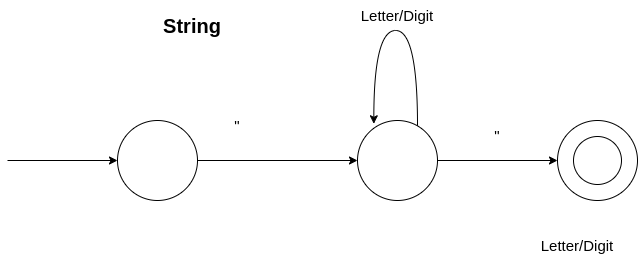
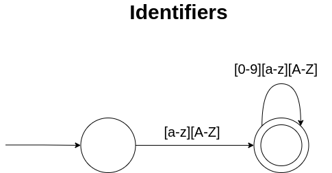
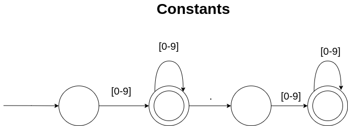

# [Tiny Programming Language Compiler](https://a7medayman6.github.io/Tiny-Compiler/)

**Compiler for the TINY Programming Language described in [Language Description](Language-Description.md).**

- [TINY Programming Language](#tiny-programming-language)
  - [Language Description](#language-description)
- [TINY Language Regular Expressions](#tiny-language-regular-expressions)
- [TINY Language Deterministic Finite Automaton DFA](#tiny-language-deterministic-finite-automaton-dfa)
- [TINY Language Context Free Grammar CFG](#tiny-language-context-free-grammar-cfg)
- [TINY Code Samples](#tiny-code-samples)
  - [Sample program includes all 30 rules](#sample-program-includes-all-30-rules)
  - [Sample program in Tiny language – computes factorial](#sample-program-in-tiny-language-–-computes-factorial)

## TINY Programming Language

> A program in TINY consists of a set of functions (any number of functions and ends with a main function), each function is a sequence of statements including (declaration, assignment, write, read, if, repeat, function, comment, …) each statement consists of (number, string, identifier, expression, condition, …).

### Language Description

- Number: any sequence of digits and maybe floats (e.g. 123 | 554 | 205 | 0.23 | …)
- String: starts with double quotes followed by any combination of characters and digits then ends with double quotes (e.g. “Hello” | “2nd + 3rd” | …)
- Reserved_Keywords: int | float | string | read | write | repeat | until | if | elseif | else | then | return | endl
- Comment_Statement: starts with /* followed by any combination of characters and digits then ends with */ (e.g. /*this is a comment*/ | …)
- Identifiers: starts with letter then any combination of letters and digits. (e.g. x | val | counter1 | str1 | s2 | …)
- Function_Call: starts with Identifier then left bracket “(“ followed by zero or more Identifier separated by “,” and ends with right bracket “)”. (e.g. sum(a,b) | factorial(c) | rand() | … )
- Term: maybe Number or Identifier or function call. (e.g. 441 | var1 | sum(a,b) | …)
- Arithmetic_Operator: any arithmetic operation (+ | - | * | / )
- Equation: starts with Term or left bracket “(“ followed by one or more Arithmetic_Operator and Term. with right bracket “)” for each left bracket (e.g. 3+5 | x +1 | (2+3)*10 | …)
- Expression: may be a String, Term or Equation (e.g. “hi” | counter | 404 | 2+3 | …)
- Assignment_Statement: starts with Identifier then assignment operator “:=” followed by Expression (e.g. x := 1 | y:= 2+3 | z := 2+3*2+(2-3)/1 | …)
- Datatype: set of reserved keywords (int, float, string)
- Declaration_Statement: starts with Datatype then one or more identifiers (assignment statement might exist) separated by coma and ends with semi-colon. (e.g. int x; | float x1,x2:=1,xy:=3; | …)
- Write_Statement: starts with reserved keyword “write” followed by an Expression or endl and ends with semi-colon (e.g. write x; | write 5; | write 3+5; | write “Hello World”; | …)
- Read_Statement: starts with reserved keyword “read” followed by an Identifier and ends with semi-colon (e.g. read x; | …)
- Return_Statement: starts with reserved keyword “return” followed by Expression then ends with semi-colon (e.g. return a+b; | return 5; | return “Hi”; | …)
- Condition_Operator: ( less than “<” | greater than “>” | is equal “=” | not equal “<>”)
- Condition: starts with Identifier then Condition_Operator then Term (e.g. z1 <> 10)
- Boolean_Operator: AND operator “&&” and OR operator “||”
- Condition_Statement: starts with Condition followed by zero or more Boolean_Operator and Condition  (e.g. x < 5 && x > 1)
- If_Statement: starts with reserved keyword “if” followed by Condition_Statement then reserved keyword “then” followed by set of Statements (i.e. any type of statement: write, read, assignment, declaration, …) then Else_If_Statment or Else_Statment or reserved keyword “end”
- Else_If_Statement: same as if statement but starts with reserved keyword “elseif”
- Else_Statement: starts with reserved keyword “else” followed by a set of Statements then ends with reserved keyword “end”
- Repeat_Statement: starts with reserved keyword “repeat” followed by a set of Statements then reserved keyword “until” followed by Condition_Statement
- FunctionName: same as Identifier
- Parameter: starts with Datatype followed by Identifier  (e.g. int x)
- Function_Declaration: starts with Datatype followed by FunctionName followed by “(“ then zero or more Parameter separated by “,” then “)” (e.g. int sum(int a, int b) | …)
- Function_Body: starts with curly bracket “{” then a set of Statements followed by Return_Statement and ends with “}”
- Function_Statement: starts with Function_Declaration followed by Function_Body
- Main_Function: starts with Datatype followed by reserved keyword “main” then “()” followed by Function_Body
- Program: has zero or more Function_Statement followed by Main_Function

______________________________________________

## TINY Language Regular Expressions

digit ::= 0|1|2|3|4......|9

letter ::= [a-z][A-Z]

Number ::= digit*.?digit*

String ::= "(letter|digit)*"

Reserved_Keywords ::=  int | float | string | read | write |
repeat | until | if | elseif | else | then | return | endl

Comment ::= /\*String\*\/

Identifier ::= letter (letter | digit)*

Term ::= Number | Identifier | Function_Call

Arithmatic_Operator ::= + | - | * | /

Equation ::=  (Term (Arithmatic_Operator (Equation | Term))+) | (\( Term Arithmatic_Operator ( Equation | Term) \)) (Arithmatic_Operator (Term | Equation))*

Expression ::= String | Term | Equation

Datatype ::= int | float | string

Condition_Operator ::= < | > | = | <>

Boolean_Operator ::= && | \|\|


______________________________________________

## TINY Language Deterministic Finite Automaton DFA

- Strings



- Reserved Words


- Operators


- Identifiers



- Constants



- Comments


______________________________________________

## TINY Language Context Free Grammar CFG

- Program → Program_Function_Statement Main_Function

- Main_Function → Data_Type main ( ) Function_Body

- Program_Function_Statement → Function_Statement Program_Function_Statement | ɛ

  - Function_Statement → Function_Declaration Function_Body

  - Function_Declaration → Data_Type Function_Name ( Function_Parameters )

  - Datatype → int | float | string

  - Function_Name → identifier

  - Function_Parameters → Data_Type Identifier More_Parameters | ɛ

  - More_Function_Parameters → , Data_Type Identifier More_Function_Parameters | ɛ

  - Function_Body → { Statements Return_Statement }

- Statements → State Statements | ɛ

  - Statement → Function_Call | Assignment_Statement | Declaration_Statement | Write_Statement | Read_Statement | If_Statement | Repeat_Statement

- Function_Call → Identifier ( Parameters) ;

  - Parameters → Expression More_Parameters | ɛ
  - More_Parameters → , Expression More_Parameters | ɛ

- Assignment_Statement → Identifier := Expression

- Expression → String | Term | Equation

- Term → number | identifier | Function_Call

- Equation → Term Operator_Equation | (Equation) Operator_Equation 

- Operator_Equation → Arthematic_Operator Equation Operator_Equation | ε

	- Arthematic_Operator → plus | minus | divide | multiply 

- Declaration_Statement → Data_Type Identifier Declare_Rest1 Declare_Rest2 ;

  - Declare_Rest1 → , identifier Declare_Rest1 | ɛ

  - Declare_Rest2 → Assignment_Statement | ɛ

- Write_Statement → write Write_Rest ;

  - Write_Rest → Expression | endl

- Read_Statement → read identifier ;

- If_Statement → if Condition_Statement then Statements Other_Conditions

  - Condition_statement → Condition

  - Condition → identifier Condition_Operator Term More_Conditions

  - Condition_Operator → less_than | greater_than | not_equal | equal

  - More_Conditions → and Condition | or Condition| ɛ

  - Other_Conditions → Else_if_Statement | Else_statement | end


- Else_if_Statement → elseif Condition_statement then Statements Other_Conditions

- Else_statement → else Statements end

- Repeat_Statement → repeat Statements untill Condition_statement

- Return_Statement → return Expression ;

______________________________________________

## TINY Code Samples

### Sample program includes all 30 rules

```tiny
int sum(int a, int b)
{
	return a + b;
}
int main()
{
	int val, counter;
	read val;

	counter := 0;

	repeat                                                                                
		val := val - 1;
		write "Iteration number [";
		write counter;
		write "] the value of x = ";
		write val;
		write endl;                          
		counter := counter+1;                                                      
	until val = 1

	write endl;

	string s := "number of Iterations = ";
	write s; 

	counter := counter-1;

	write counter;

	/* complicated equation */    
	float z1 := 3*2*(2+1)/2-5.3;
	z1 := z1 + sum(a,y);

	if  z1 > 5 || z1 < counter && z1 = 1 
	then 
		write z1;
	elseif z1 < 5 
	then
		z1 := 5;
	else
	    z1 := counter;
	end

	return 0;
}

```

### Sample program in Tiny language – computes factorial

```tiny
/* Sample program in Tiny language – computes factorial*/
int main()
{
	int x;
	read x; /*input an integer*/
	if x > 0 /*don’t compute if x <= 0 */
	then 
		int fact := 1;

		repeat
			fact := fact * x;
			x := x – 1;
		until x = 0

		write fact; /*output factorial of x*/
	end
	return 0;
}
```

